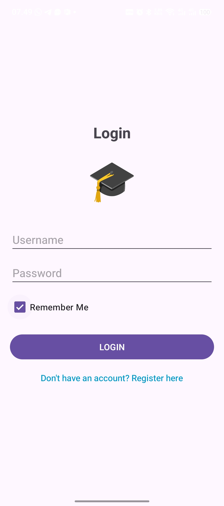
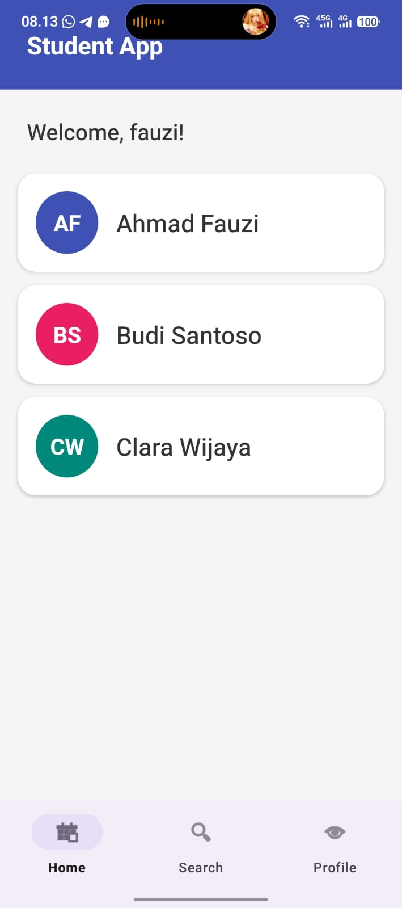
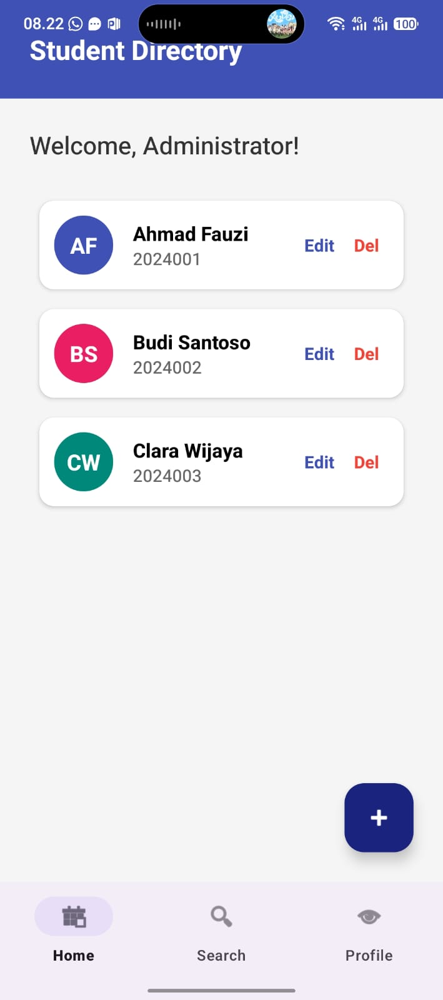
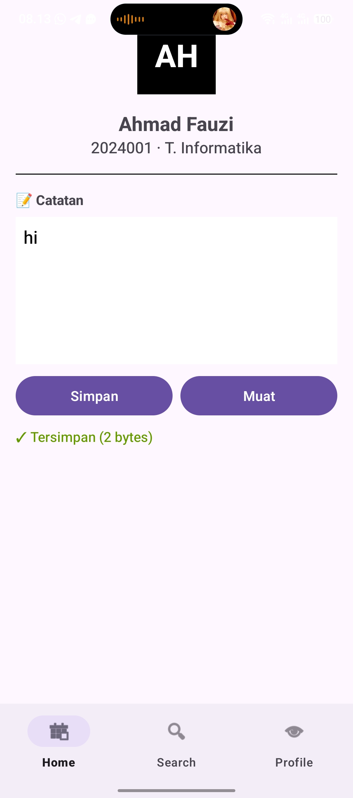
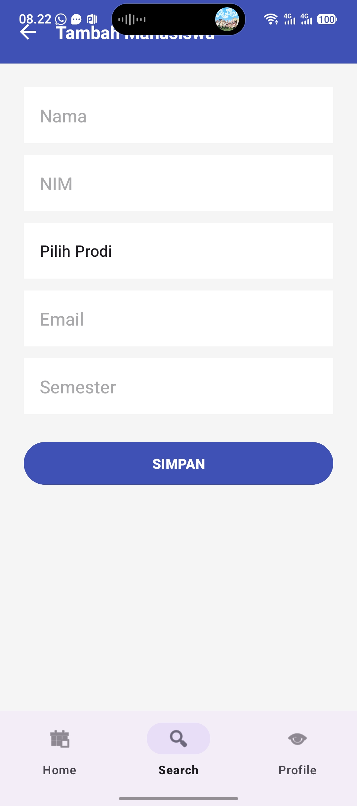
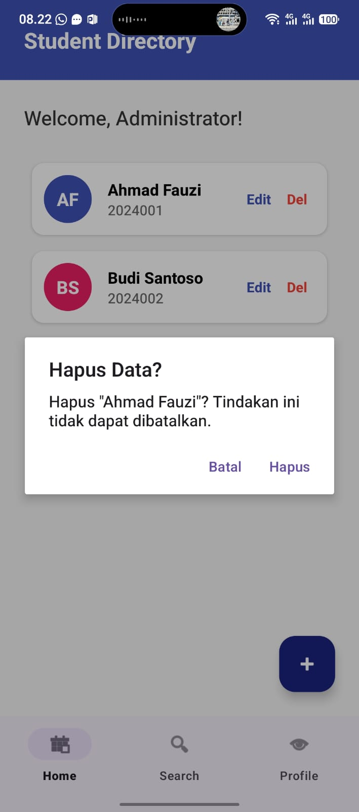

# StudentContactApp

## 👤 Identitas
- Nama: Karina Septia Suwandi
- NIM: F1D02310066

---

## 📱 Deskripsi Aplikasi
**StudentContactApp** adalah aplikasi manajemen data mahasiswa yang mengintegrasikan berbagai metode penyimpanan data pada platform Android. Aplikasi ini dirancang untuk mendemonstrasikan penggunaan SharedPreferences, Internal Storage, dan Room Database dalam satu ekosistem aplikasi yang fungsional, memudahkan pengelolaan profil mahasiswa, catatan privat, dan pengaturan aplikasi.

### Fitur Utama:
1. **Manajemen Sesi & Pengaturan (SharedPreferences)**:
    - Autentikasi Login dengan fitur "Remember Me".
    - Pengaturan profil pengguna untuk mengaktifkan Dark Mode dan Notifikasi.
2. **Manajemen Data Mahasiswa (Room Database)**:
    - Operasi CRUD (Create, Read, Update, Delete) lengkap untuk data profil mahasiswa.
    - Pencarian mahasiswa berdasarkan Nama atau NIM secara real-time.
    - Fitur hapus data dengan dukungan *Swipe-to-Delete* dan *Undo* menggunakan Snackbar.
3. **Catatan Pribadi (Internal Storage)**:
    - Fitur penyimpanan catatan teks khusus untuk setiap mahasiswa yang disimpan secara privat di penyimpanan internal perangkat.
4. **Navigasi Modern**:
    - Implementasi Navigation Component dengan Bottom Navigation View untuk perpindahan antar halaman yang mulus.

---

## 💾 Metode Penyimpanan & Alasan
1. **SharedPreferences**: Digunakan untuk menyimpan session login dan preferensi user (seperti dark mode) karena sangat efisien untuk data berukuran kecil dalam bentuk pasangan kunci-nilai (key-value), serta memiliki performa akses yang sangat cepat.
2. **Internal Storage**: Digunakan untuk menyimpan catatan tambahan mahasiswa dalam format file `.txt`. Dipilih karena menjamin privasi data yang hanya bisa diakses oleh aplikasi ini sendiri, cocok untuk data teks yang bersifat spesifik per entitas.
3. **Room Database**: Digunakan untuk menyimpan data profil mahasiswa secara terstruktur. Dipilih karena Room menyediakan lapisan abstraksi di atas SQLite yang memudahkan pengelolaan basis data relasional, mendukung kueri pencarian yang kompleks, dan menjamin integritas data.

---

## 🛠️ Kendala & Solusi
1. **Kendala: Error "Unresolved Reference" pada ViewBinding dan Safe Args**
    - **Penyebab**: IDE belum men-generate class pembantu secara otomatis saat kode referensi baru ditulis.
    - **Solusi**: Melakukan *Rebuild Project* dan *Gradle Sync* secara berkala untuk memicu generasi class Binding dan Directions.
2. **Kendala: Error Konfigurasi Safe Args Terkait AndroidX**
    - **Penyebab**: Plugin Safe Args memerlukan verifikasi proyek AndroidX.
    - **Solusi**: Menambahkan konfigurasi `android.useAndroidX=true` dan `android.enableJetifier=true` pada file `gradle.properties`.
3. **Kendala: Navigasi Action Tidak Ditemukan**
    - **Penyebab**: Belum mendefinisikan rute navigasi dari SearchFragment ke halaman lain di dalam file navigasi.
    - **Solusi**: Memperbarui `nav_graph.xml` dengan menambahkan elemen `<action>` yang sesuai untuk setiap perpindahan antar fragment.

---

## 🖼️ Screenshot Aplikasi

### 🔐 Halaman Login

### 📝 Halaman Mahasiswa

### 📝 Halaman Admin

### 📄 Halaman Detail & Catatan

### ➕ Form Tambah / Edit Data

### 🗑️ Fitur Hapus Data

